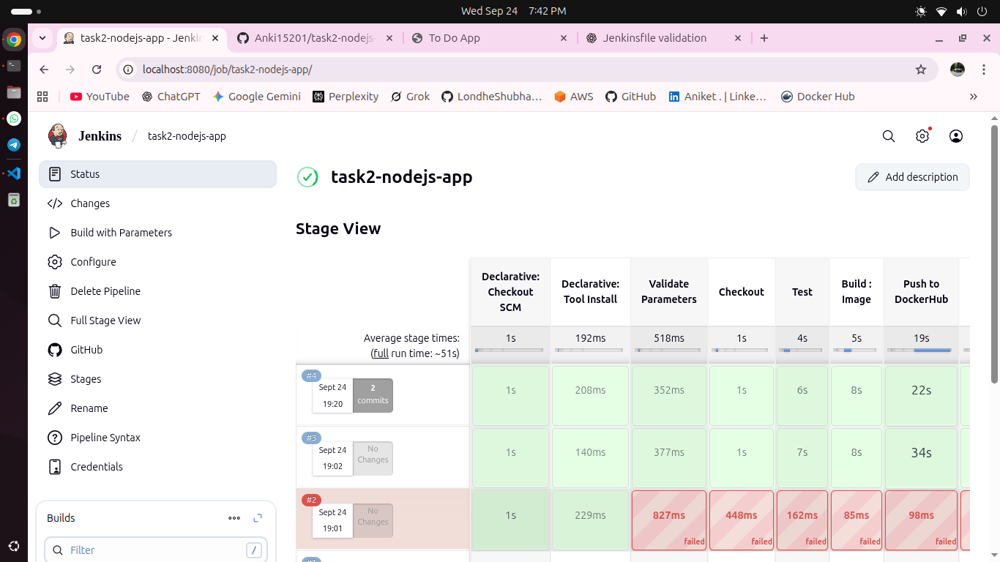
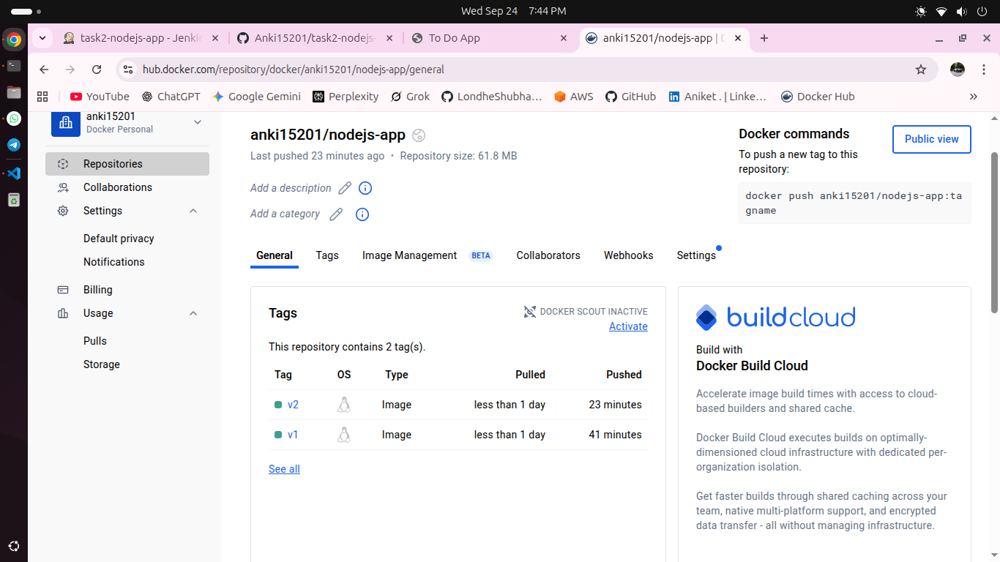
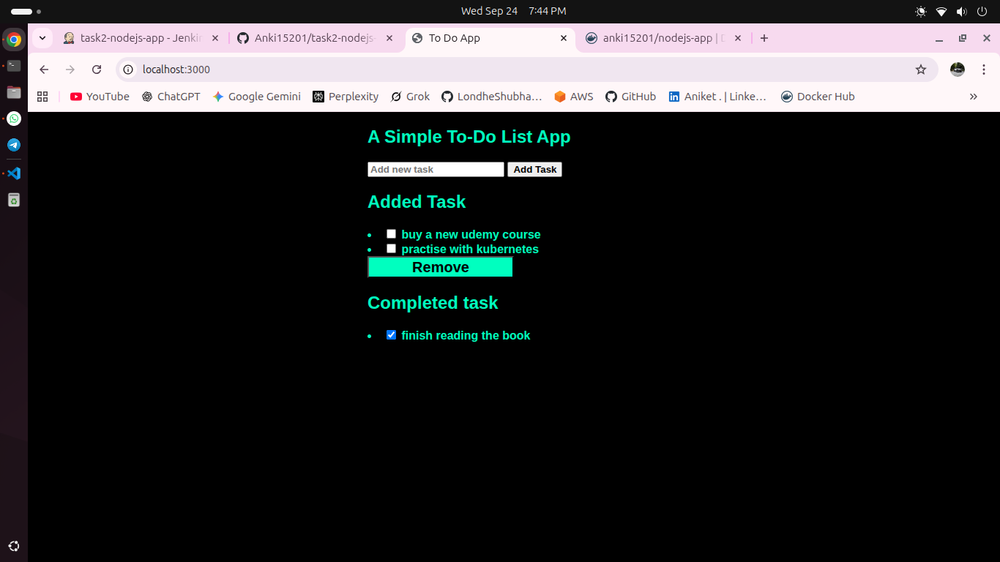

# NodeJS Dockerized Application CI/CD

This project demonstrates a **CI/CD pipeline using Jenkins** for a NodeJS application, including building a Docker image, pushing it to DockerHub, and deploying it on a server.

---

## **Project Overview**

- **Application:** NodeJS (Express.js)
- **Dockerized:** Yes
- **CI/CD Tool:** Jenkins
- **Docker Registry:** DockerHub
- **Pipeline Stages:**
  1. **Validate Parameters** – Ensures `IMAGE_TAG` is provided.
  2. **Checkout** – Pulls code from Git repository.
  3. **Test** – Runs `npm install` and `npm test`.
  4. **Build Image** – Builds Docker image with provided tag.
  5. **Push to DockerHub** – Pushes image to DockerHub using credentials.
  6. **Deploy** – Stops old container (if any) and runs a new container.

---

## **Jenkins Pipeline**

The pipeline is defined in `Jenkinsfile`. Key points:

- Uses **NodeJS** as the build tool.
- Requires `IMAGE_TAG` as a pipeline parameter.
- Docker commands are executed on the Jenkins agent.
- DockerHub credentials must be configured in Jenkins.

**Example:**
```groovy
pipeline {
    agent any

    environment {
        IMAGE_NAME = 'anki15201/nodejs-app'
    }

    parameters {
        string(name: 'IMAGE_TAG', defaultValue: '', description: 'Docker image tag')
    }

    tools {
        nodejs 'NodeJS'
    }

    stages {
        stage("Validate Parameters") { ... }
        stage("Checkout") { ... }
        stage("Test") { ... }
        stage("Build : Image") { ... }
        stage("Push to DockerHub") { ... }
        stage("Deploy") { ... }
    }
}

Setup Instructions

Clone the repository:

git https://github.com/Anki15201/task2-nodejs-app.git
cd task2-nodejs-app


Ensure Docker is installed:

docker --version


Run Jenkins Pipeline:

Create a new Jenkins pipeline job.

Add Jenkinsfile from the repository.

Provide IMAGE_TAG when triggering the pipeline.

Access Application:

After deployment, access your NodeJS app at:

http://<jenkins-server-ip>:3000


If running locally, use:

http://localhost:3000

Docker Image

Docker image name: anki15201/nodejs-app

Docker tag: <IMAGE_TAG>

Pushed to: DockerHub

Pipeline Screenshot



DockerHub Screenshot


Application Screenshot


Notes

Ensure dockerhubcred credentials are added in Jenkins.

Ensure port 3000 is free before deployment.

Make sure views folder exists if using Express res.render().

Project Structure

project-root/
├─ src/
│  └─ index.js
├─ views/
│  └─ index.ejs
├─ screenshots/
│  ├─ jenkins_pipeline.png
│  └─ dockerhub.png
├─ Dockerfile
├─ Jenkinsfile
├─ package.json
└─ README.md
